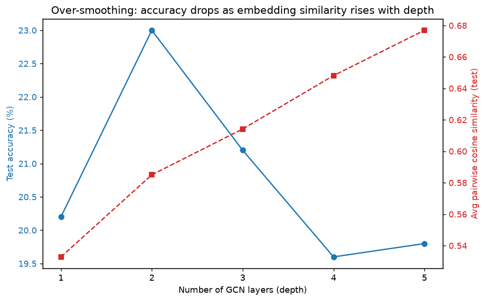
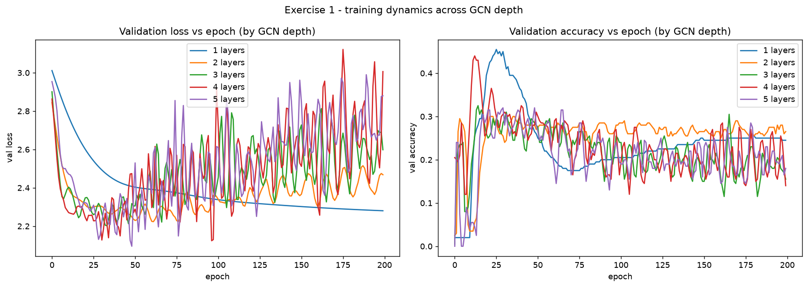
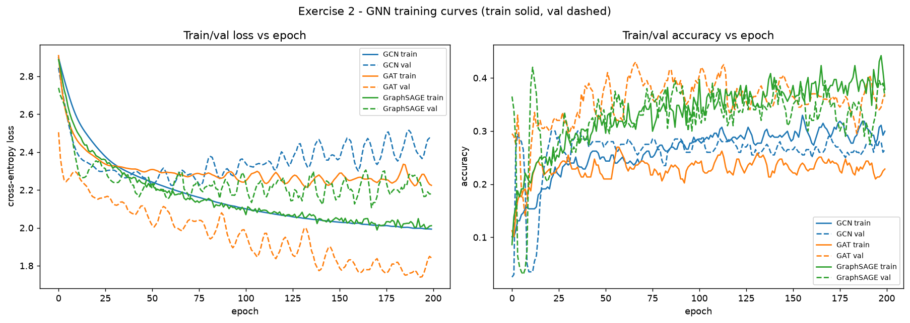
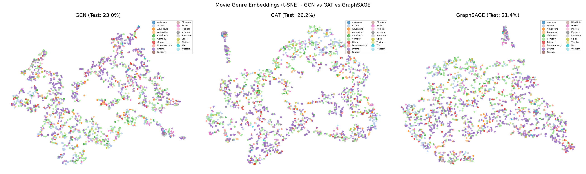
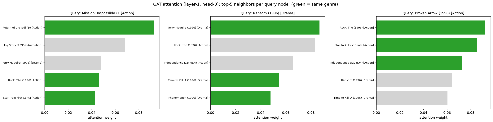
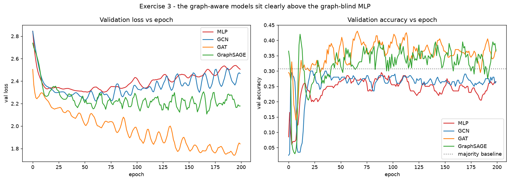
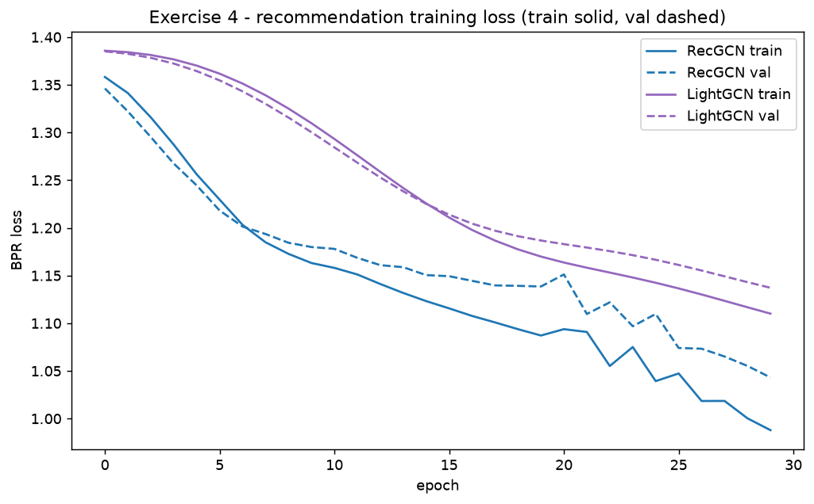
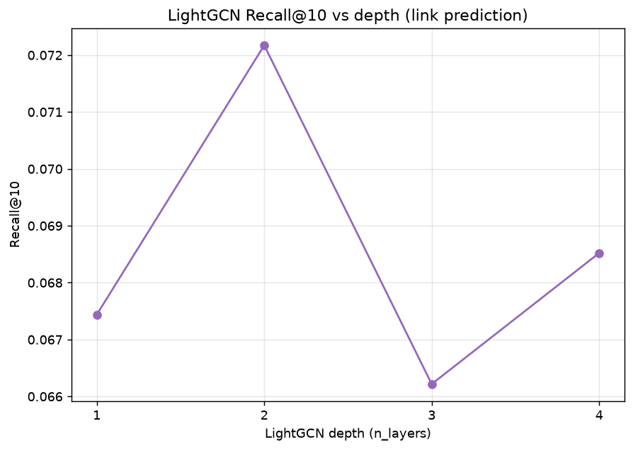

# DL-AIT Assignment 5 | Student: Dechathon Niamsa-ard [st126235]

**Graph Neural Networks**

Graph Neural Networks implemented **from scratch** (no PyTorch Geometric) on **MovieLens-100k**:
GCN, GAT, GraphSAGE, an MLP baseline, and LightGCN. All four assignment exercises are completed in
[`A5-Graph-Neural-Networks.ipynb`](A5-Graph-Neural-Networks.ipynb) with every cell executed and
output visible.

- **Tasks:** predict each movie's primary genre (node classification, 19 classes) and recommend
  movies (link prediction).
- **Graph:** 1,682 movie nodes; each movie is linked to its **8 most similar movies** by cosine
  similarity of their rating vectors — a sparse, popularity-normalized co-rating graph
  (avg degree ~13, edge homophily 0.37).
- **Node features (non-leaking):** release year, average rating, and log #ratings. The genre
  one-hot flags are **deliberately excluded** — since the label is `argmax(genre flags)`, using them
  as features would leak the answer (a plain MLP would then score ~97%) and make "does the graph
  help?" meaningless.
- **Hardware:** trained on GPU (NVIDIA RTX 5060 Ti, Blackwell `sm_120`) with PyTorch `cu128`.
- **Training:** every training run prints a per-epoch training log (train/val loss + accuracy) and a
  train/val loss curve — embedded in the notebook and shown per exercise below.

## Reproduce (uv + GPU)

```bash
uv sync                                   # installs torch (cu128) + deps into .venv
uv run python -m ipykernel install --user --name a5gnn --display-name "Python 3 (A5 GNN)"
uv run jupyter nbconvert --to notebook --execute --inplace \
    --ExecutePreprocessor.kernel_name=a5gnn "A5-Graph-Neural-Networks.ipynb"
```

The MovieLens-100k dataset is downloaded automatically on first run. A fixed seed (42) is set before
every training run. The RTX 50-series (Blackwell, `sm_120`) requires CUDA 12.8+ wheels, configured via
the `pytorch-cu128` index in [`pyproject.toml`](pyproject.toml).

---

## Results

### Exercise 1 - Over-smoothing: how deep is too deep?

| # Layers | Test Accuracy | Avg cosine similarity |
|---|---|---|
| 1 | 20.20% | 0.5328 |
| 2 | 23.00% | 0.5850 |
| 3 | 21.20% | 0.6142 |
| 4 | 19.60% | 0.6482 |
| 5 | 19.80% | 0.6769 |



Per-depth training curves (validation loss/accuracy over epochs — the per-epoch training log is printed in the notebook):



Accuracy peaks at shallow depth and drops noticeably around **depth 3**, while the average
pairwise cosine similarity of the propagated test features (`Â^k X`) climbs **monotonically** with
depth. Each GCN layer applies the low-pass operator `D^-1/2 (A+I) D^-1/2`; stacking `k` layers applies
it `k` times, washing out the high-frequency components that distinguish nodes and pushing every
embedding toward the same vector (**over-smoothing**) until the classifier can no longer separate genres.

### Exercise 2 - GCN vs GAT vs GraphSAGE

| Model | Test Accuracy | Avg epoch time |
|---|---|---|
| GCN | 23.00% | 1.1 ms |
| GAT (8 heads) | 26.20% | 41.8 ms |
| GraphSAGE (k=10) | 21.40% | 394.9 ms |

Training curves for the three GNNs (train solid, validation dashed):





**Attention (Exercise 2b):** across 3 sample query nodes, **60%** of each node's
top-5 attended neighbors share the query movie's primary genre (green bars below) - well above the
graph's 0.37 edge homophily, so GAT learns to attend to same-genre neighbors (not 100%, since
some co-rating edges are genuinely cross-genre).



**2c - when does each win?** GAT beats GCN by the largest margin when **neighbor importance is
heterogeneous** (some neighbors far more informative, or many noisy edges) - GCN can only weight by
degree, GAT learns per-edge content-aware weights. GraphSAGE beats GCN on **large / inductive** graphs
(new unseen nodes, billions of nodes): neighbor sampling gives constant `O(k)` memory and lets it
embed nodes it never trained on, where full-matrix GCN (`O(N^2)`) cannot. *(GraphSAGE is the slowest
per epoch here only because the teaching layer loops over nodes in Python - an implementation
artifact, not a property of the algorithm.)*

### Exercise 3 - MLP baseline: does the graph help?

| Model | Test Accuracy |
|---|---|
| MLP (no graph) | 14.40% |
| GCN | 23.00% |
| GAT | 26.20% |
| GraphSAGE | 21.40% |

Validation curves — every graph-aware model sits clearly above the graph-blind MLP:



Given the **same** non-leaking features, adding the graph lifts accuracy from the graph-blind MLP to
the GNNs by **up to +11.8 percentage points (best: GAT 26.2% vs MLP 14.4%)**. Both sit near the hard 19-way majority baseline (30.8%,
always-predict-Drama) because genre is genuinely hard to predict from collaborative signal alone - but
that is the point: the MLP sees only per-movie metadata, while the GNNs also exploit the co-rating
graph, a relational signal absent from the features. **Relational information is irreducible** - it
cannot be folded into per-node features, so when relationships are informative a GNN beats an
otherwise-identical MLP. (Using the genre flags as features would let an MLP hit ~97% via label
leakage, not learning - which is why we exclude them.)

### Exercise 4 - LightGCN: when less is more

| Model | # Params | AUC | Recall@10 |
|---|---|---|---|
| RecGCN (with W) | 80,544 | 0.8458 | 0.0608 |
| LightGCN (no W) | 76,448 | 0.8696 | 0.0662 |

Recommendation training loss (train solid, validation dashed):





LightGCN matches/beats RecGCN with **fewer parameters** by dropping the weight matrix `W` and the
non-linearity - unnecessary capacity when the inputs are already learned embeddings. **Over-smoothing
(4c):** Recall@10 stays in a narrow band across depth 1-4 (~0.066-0.072) rather than collapsing. LightGCN averages embeddings across all layers `0..K`, so the shallow
(ego) embedding is always retained and nodes stay distinguishable - unlike the deep node-classification
GCN in Exercise 1. **What it learns (4d):** the only trainable parameters are the user and item ID
embedding tables; propagation and dot-product scoring are parameter-free, so all capacity goes into
learning a 32-dim vector per user/movie whose dot product is high for liked pairs.

---

## Discussion - when would you use a GNN instead of an MLP?

Use a GNN whenever the *relationships* between examples carry signal that per-example features do not -
an MLP treats each example independently, so it literally cannot see the graph. A concrete example
(drug discovery, as in the class lab): represent a molecule as a graph with atoms as nodes and bonds as
edges, then use ~3-4 GCN layers to predict toxicity - the prediction depends on functional groups
(2-3 hop local structure) and overall shape (4-5 hops), exactly the relational structure a GNN
aggregates and an MLP over atom features alone would miss. This assignment shows the same effect in
miniature: with identical features, the co-rating graph lifts genre accuracy 11.8 points above the
MLP, because "which movies similar users watch together" is information that simply is not in any single
movie's feature vector.

---

## Repository contents

- [`A5-Graph-Neural-Networks.ipynb`](A5-Graph-Neural-Networks.ipynb) - completed notebook, all cells executed.
- [`figures/`](figures/) - training/loss curves, over-smoothing, t-SNE, attention, and LightGCN-depth plots.
- [`pyproject.toml`](pyproject.toml) + `uv.lock` - reproducible environment (PyTorch cu128 / GPU).
- [`lab_note/`](lab_note/) - class teaching material the implementations build on.

*Commit message: `A5: Graph Neural Networks - st126235`*
